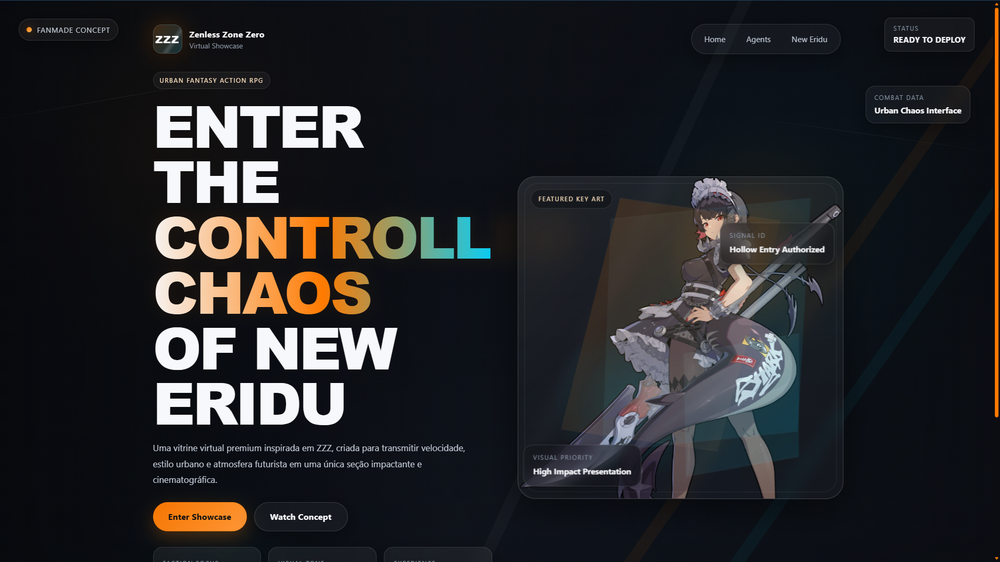

# 🎮 Zenless Zone Zero Website

<p align="center">
  
</p>

Uma vitrine virtual inspirada em **Zenless Zone Zero**, desenvolvida com **HTML, CSS e JavaScript puro**, com foco em direção de arte, layout premium e apresentação visual de personagens em uma experiência de **seção única**.

Este projeto foi criado como peça de portfólio para explorar:
- interface inspirada em jogos
- composição cinematográfica
- animações leves
- rotação dinâmica de personagens
- front-end visual para páginas promocionais

---

## 🌐 Visão Geral

O projeto apresenta uma página única altamente estilizada, inspirada em landing pages promocionais de games AAA.  
A proposta é transformar uma simples vitrine em uma experiência visual forte, com:

- hero section de alto impacto
- personagem principal em destaque
- informações visuais integradas ao layout
- efeitos premium com CSS e JavaScript
- troca automática de personagem ao recarregar a página

---

## ✨ Funcionalidades

- Layout premium em **uma única seção**
- Visual inspirado em **UI de jogos**
- Efeitos de glow, profundidade e sobreposição
- Scrollbar personalizada
- Personagem principal dinâmico
- Rotação automática de personagens no reload
- Estrutura separada para CSS principal e lógica do personagem
- Responsividade para diferentes tamanhos de tela

---

## 🔄 Sistema de rotação de personagens

O projeto possui um sistema que troca automaticamente o personagem principal sempre que a página é recarregada.

### Como funciona:
- o JavaScript acessa uma lista de nomes de arquivos
- escolhe um personagem aleatório
- atualiza dinamicamente o `src` da imagem principal
- pode evitar repetição imediata com `localStorage`

Exemplo de personagens usados:
- Anby
- Billy Kid
- Burnice
- Ellen
- Jane
- Ju Fufu
- Nicole

---

## 📁 Arquitetura do Projeto  

```bash  
02 - ZENLESS ZONE ZERO WEBSITE  
│  
├── assets  
│   ├── icon  
│   ├── images  
│   │   ├── bg  
│   │   └── characters  
│   │       ├── anby.png  
│   │       ├── billy-kid.png  
│   │       ├── burnice.png  
│   │       ├── ellen.png  
│   │       ├── jane.png  
│   │       ├── ju-fufu.png  
│   │       └── nicole.png  
│   ├── logo  
│   ├── ui  
│   └── preview  
│  
├── css  
│   ├── character.css  
│   └── style.css  
│  
├── js  
│   ├── character-rotation.js  
│   └── main.js  
│  
├── index.html  
└── README.md  

---

## 🧩 Estrutura dos Arquivos

### `index.html`

Arquivo principal da aplicação.  
Define toda a **estrutura da página**, incluindo a hero section, área de exibição do personagem, textos, botões e os elementos visuais que compõem a vitrine do jogo.

Também é responsável por importar:

- os estilos CSS
- os scripts JavaScript
- as imagens e assets do projeto

---

### `css/style.css`

Arquivo principal de estilos do projeto.

Contém a estilização global da página, incluindo:

- layout geral
- grid e posicionamento
- tipografia
- cores e gradientes
- botões
- painéis de interface
- efeitos de glow
- responsividade

É o arquivo que define a **identidade visual do site**.

---

### `css/character.css`

Arquivo dedicado exclusivamente à estilização do personagem principal exibido na vitrine.

Esse arquivo controla:

- posicionamento da arte
- enquadramento do personagem
- ajustes de escala
- alinhamento dentro do container visual
- sobreposição de camadas

Separar esse estilo do CSS principal ajuda a manter o código mais organizado e facilita ajustes específicos para cada personagem.

---

### `js/main.js`

Arquivo responsável pelos comportamentos gerais da página.

Entre suas funções estão:

- inicialização de efeitos visuais
- animações leves de interface
- interações de elementos
- efeitos de profundidade e iluminação
- ajustes de comportamento da UI

Esse script controla a **parte interativa da experiência visual**.

---

### `js/character-rotation.js`

Script responsável pela **troca dinâmica do personagem principal**.

Ao carregar a página, o algoritmo:

1. possui uma lista de personagens disponíveis
2. seleciona um personagem aleatório
3. altera dinamicamente o atributo `src` da imagem principal
4. carrega o novo personagem na vitrine

Opcionalmente, o script pode utilizar `localStorage` para evitar repetir o mesmo personagem duas vezes seguidas.

---

### `assets/images/characters`

Pasta que contém as imagens dos personagens utilizadas pelo sistema de rotação.

Exemplo de personagens disponíveis:

- `anby.png`
- `billy-kid.png`
- `burnice.png`
- `ellen.png`
- `jane.png`
- `ju-fufu.png`
- `nicole.png`

Todas as imagens devem ter **fundo transparente** para permitir um melhor enquadramento visual no layout.

---

### `assets/images/bg`

Contém as imagens utilizadas como **background do site**, incluindo:

- fundos texturizados
- imagens temáticas
- camadas visuais de ambientação

Esses elementos ajudam a construir a atmosfera urbana e futurista do layout.

---

### `assets/ui`

Pasta destinada aos elementos visuais de interface utilizados no site.

Exemplos:

- shapes
- overlays
- elementos gráficos
- efeitos visuais
- assets decorativos

---

### `assets/logo`

Contém as imagens relacionadas à identidade visual do projeto, como:

- logotipo
- variações do logo
- elementos de marca

---

### `assets/icon`

Pasta dedicada aos ícones utilizados na interface.

Pode incluir:

- ícones de navegação
- ícones de UI
- favicons